# MICROSOFT STUDIOS 


%%html


## Goals & Overview ##

I was presented with the following tables for this project and used a combination of: python, pandas, matplotlib, and sql (pronounced: sequel) to develop and analyse questions: 

* bom_movie_gross
* name_basics
* title_akas
* title_basics
* title_crew
* title_principals
* title_ratings
* tmdb_movies
* tn_movie_budgets
   

## Question: Who are the top studios in the industry, what are some of their top successes, does vote count and popularity equate to positive box office receipts? 


```python
Top_5_studio = bom_tn_movie_merge.head().groupby('studio')['profit'].agg('sum').sort_values(ascending= False)
Top_5_studio

studio
BV      1283884402
WB       968100837
Sum.     938634579
P/DW     829981460
Par.     763589720
Name: profit, dtype: int64

        
        # top five studios
Top_5_studio.plot.bar(figsize=(8,4), color= 'red')
plt.title("Top 5 Movie Studio's")
plt.xlabel("STUDIO'S")
plt.xticks(rotation = 45)
plt.ylabel('Profit in Billions')
plt.style.use('ggplot') 
```
*During the preliminary phase Sony made this list based on soley on domestic gross, but fell off the top 5 once worldwide gross along with production costs were taken into account. The foreign figures on the bom_movie_gross table had a 30-plus percentage of missing data, so those figures were dropped and not considered.*

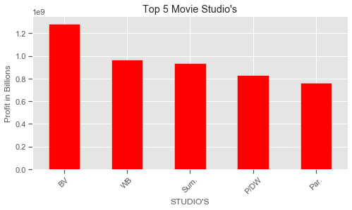

```python
# gratuitous pie chart of the top 5 movie studios
Top_5_studio.plot.pie(figsize=(13,5), subplots=True, autopct='%1.0f%%', pctdistance=.6)
locs= ['upper left', 'lower left', 'center right']
plt.title("Top 5 Studio's in Production")
labels = ['Bunea Vista', 'Warner Bros', 'Summit Entertainment', 'Dream Works', 'Paramount']
plt.legend(labels, bbox_to_anchor=(0.85, 1.025), loc='upper left')
plt.tight_layout()
```
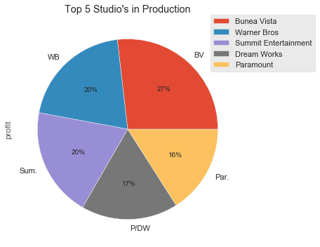


## Question: Top studio successes

*Here I felt it imperative to ascertain what films other studios, Microsofts competition, was doing well at the box office. Turns out the majority of these films are franchise.*
```python
    
# all the studios in a list obj
bom_tn_movie_merge.studio.unique()
```
*Here is the complete list of movie studio's being taken into consideration:*
```python 
array(['BV', 'WB', 'P/DW', 'Sum.', 'Par.', 'Uni.', 'Fox', 'Sony', 'FoxS',
       'SGem', 'WB (NL)', 'LGF', 'MBox', 'W/Dim.', 'Focus', 'MGM',
       'Over.', 'Mira.', 'NM', 'CBS', 'SPC', 'ParV', 'Gold.', 'RAtt.',
       'Magn.', 'IFC', 'Free', '3D', 'Wein.', 'Rela.', 'Anch.', 'App.',
       'Drft.', 'IW', 'Relbig.', 'Viv.', 'Eros', 'Scre.', 'UTV', 'Kino',
       'ATO', 'First', 'GK', 'NFC', 'Strand', 'Mont.', 'IVP', 'FD',
       'TriS', 'ORF', 'Jan.', 'Osci.', 'OMNI/FSR', None, 'SMod', 'WHE',
       'P4', 'ALP', 'LG/S', 'RTWC', 'MNE', 'LD', 'Yash', 'IM', 'A24',
       'PH', 'EOne', 'ELS', 'CE', 'Saban', 'DR', 'Trib.', 'KE', 'VE',
       'EC', 'BG', 'PFR', 'BST', 'BH Tilt', 'BSC', 'FCW', 'Cohen', 'LGP',
       'TFA', 'Alc', 'STX', 'Orch.', 'PNT', 'CJ', 'Cleopatra', 'BBC',
       'GrtIndia', 'Neon', 'Affirm', 'ENTMP', 'Studio 8', 'Annapurna',
       'Global Road', 'Amazon', 'RLJ'], dtype=object)


# grouping by studio
g = bom_tn_movie_merge.groupby('studio')
g

# looping through all the studios and separating their data
# not very readable
for studio, studio in g:
    print(studio)
    print(bom_tn_movie_merge)
    
    
# this is how I access each studios information
# Sony dropped out from the initial prediction using just the bom_movie_gross table
BV_df = g.get_group('BV')
WB_df = g.get_group('WB')
Sum_df = g.get_group('Sum.')
Par_df = g.get_group('Par.')
Dream_Works_df = g.get_group('P/DW')
```
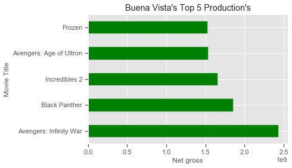
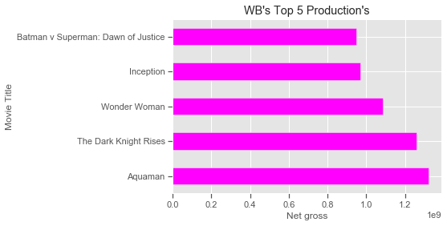
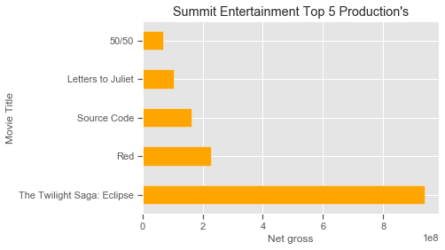
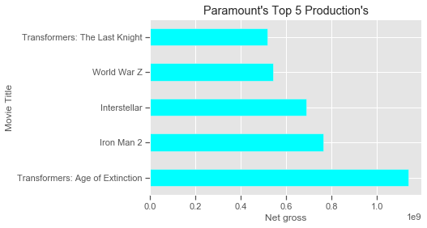
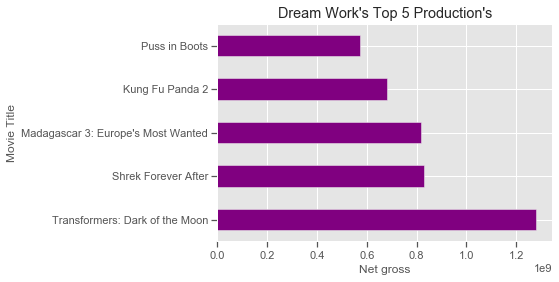
```python
# merge for popularity and vote count comparison 
tmdb_bom_merge = pd.merge(bom_movie_gross, tmdb_movies, on = 'title')
```

*Both of these graphs show correlation between vote count, popularity to the subsequent film and it's studio, this is not surprsing seeing as how these are franchise films and are sure to have quite a following!*
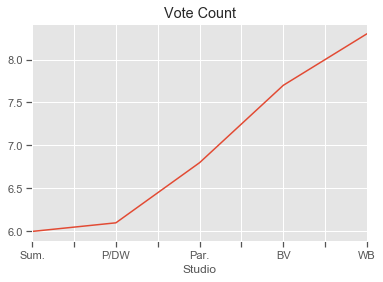
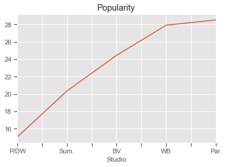
        
**Recommendation: outright purchase a studio (along with it's franchises) or find an original script that can be nurtured into a franchise and do as Hollywood does, rinse and repeat. All of the studio's are married to their franchises and a large percentage of their box office receipts shows this in their bottom line. These films have the largest impact on production budgets.*

**Future work: Ascertain the precentages of a studio's successes minus there franchise films, Tyler Perry studio's is no where near this list but can still be considered a succcess story.*


## Question: What is the best/worst time to release a film?

*Finding out the best time to release a film, other than holiday titles, is a good metric as it can be calculated long before production even begins and unforseen costs arise placing production over budget. A just-in-time approach to movie making sort of speak.* 

```python

bom_tn_movie_merge['release_month'] = bom_tn_movie_merge['release_month'].apply(lambda x : calendar.month_abbr[x])

# good workable shape 1247 rows
bom_tn_movie_merge.shape

# Now to change numerical month to str month abbreviation
best_time_to_release

release_month
Jun    30425085643
Nov    26538590451
Jul    25852570780
Dec    23649060864
May    21079955970
Mar    13574124932
Apr    13201753763
Feb    13136353718
Aug    11339542316
Oct    11090898342
Sep     9487346736
Jan     7290541068
Name: profit, dtype: int64
```
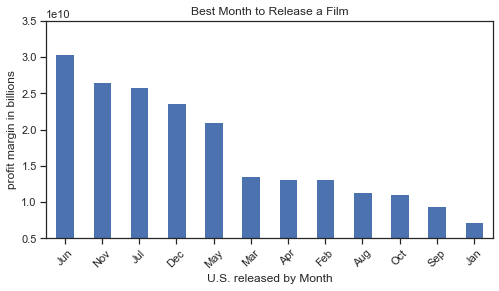

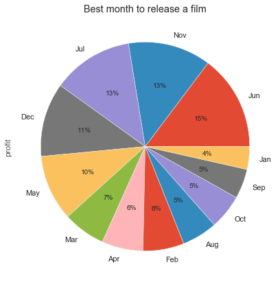


**Recommendation: I would recommend following these as potential release dates but would also recommend that other market holidays and calendars be explored. Take for instance summer time in S.America and Austrailia or Xmas in Ethiopia which is in January, this worst month according to my analysis.*

**Future work: I acknowledge worldwide releases aren't going away, especially for franchise films, given todays prevelant technologies, a film being released in a single market has the potential of being illegally copied and uploaded for illegal downloads overnight.*


## Question: Does a domestic films popularity correlate to big box office numbers here in the States?

*Although there seemed to be a correalation between popularity and vote count when comparing the top 5 studios on a global scale, that does not seem to be transferable to this dataset* 

```python
# must have removed this merge, subsequent cells below indicating that tmdb_bom_merge 
# didn't exist. Naming convention to the rescue!
tmdb_bom_merge = pd.merge(tmdb_movies, bom_movie_gross, on='title')

tmdb_bom_merge['pop/dom_gross'] = tmdb_bom_merge['popularity'] / tmdb_bom_merge['domestic_gross'] 

tmdb_bom_merge.columns
Index(['index', 'genre_ids', 'id', 'original_language', 'original_title',
       'popularity', 'release_date', 'title', 'vote_average', 'vote_count',
       'studio', 'domestic_gross', 'foreign_gross', 'year', 'pop/dom_gross'],
      dtype='object')

# how does this correalate to box office receipts? Profits?
# this is limited to domestic_gross and I can't see a correalation at all graphs are all over the place! 
# further research would be to compare other markets and to improve what contitutes a good popularity rating.  
pop = tmdb_bom_merge.groupby(['title', 'domestic_gross', 'pop/dom_gross'])['popularity'].agg('sum').sort_values(ascending= False)
pop.head(25)
```
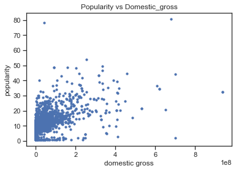


```python
title                                        domestic_gross  pop/dom_gross
Blade Runner 2049                            92100000.0      5.273724e-07     97.142
Thor: Ragnarok                               315100000.0     1.378927e-07     86.900
Avengers: Infinity War                       678800000.0     1.189938e-07     80.773
John Wick                                    43000000.0      1.816814e-06     78.123
Big Hero 6                                   222500000.0     1.659326e-07     73.840
Justice League                               229000000.0     1.526332e-07     69.906
Star Wars: The Last Jedi                     620200000.0     5.529345e-08     68.586
Doctor Strange                               232600000.0     1.420249e-07     66.070
Star Wars: The Force Awakens                 936700000.0     3.446247e-08     64.562
Spectre                                      200100000.0     1.515142e-07     60.636
Your Name.                                   5000000.0       5.647600e-06     56.476
The Hobbit: The Battle of the Five Armies    255100000.0     2.108310e-07     53.783
Kingsman: The Secret Service                 128300000.0     2.034528e-07     52.206
Coco                                         209700000.0     1.238007e-07     51.922
Arrival                                      100500000.0     2.531542e-07     50.884
Guardians of the Galaxy                      333200000.0     1.488776e-07     49.606
Fantastic Beasts: The Crimes of Grindelwald  159600000.0     3.039348e-07     48.508
Hacksaw Ridge                                67200000.0      3.582440e-07     48.148
Ralph Breaks the Internet                    201100000.0     2.389707e-07     48.057
Spider-Man: Homecoming                       334200000.0     1.399611e-07     46.775
The Martian                                  228400000.0     1.000701e-07     45.712
Ant-Man and the Wasp                         216600000.0     2.065051e-07     44.729
Avengers: Age of Ultron                      459000000.0     9.669499e-08     44.383
Black Panther                                700100000.0     6.304814e-08     44.140
The Shape of Water                           63900000.0      3.446792e-07     44.050
Name: popularity, dtype: float64

```
**Recommendation: At a value of 0.072572013 no correalation, I would recommend that merchandise associated with films is also used to gauge how popular a film is, of course this wouldn't be feasible for a lot of films, but could indicate public support for a storyline like Disney's Frozen as an example. Not sure the of a demand of IT dolls!*

**Future work: Draw a correlation between merchandise sales and movie releases.*


